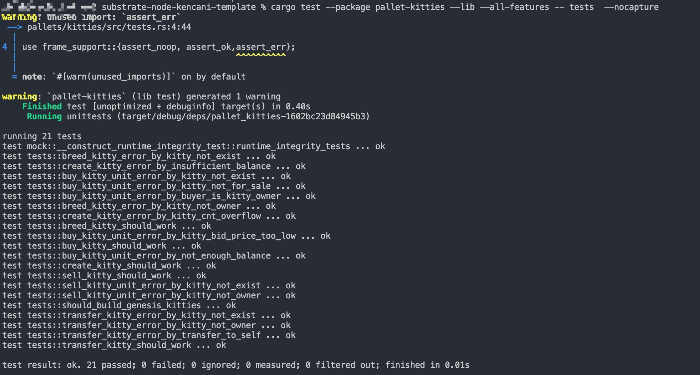

# 第二课作业 (源码在pallets/kitties)


### 第一题: 增加买和卖的extrinsic，对视频中kitties的实现进行重构，提取出公共代码

#### 具体代码

```rust

		/// 重构代码
		#[pallet::weight(100)]
		pub fn sell_kitty(
			origin: OriginFor<T>,
			kitty_id: T::KittyIndex,
			new_price: Option<BalanceOf<T>>,
		) -> DispatchResult {
			let sender = ensure_signed(origin)?;
			ensure!(Self::is_kitty_owner(&kitty_id, &sender)?, Error::<T>::NotKittyOwner);
			Self::exchange(&kitty_id, &sender, None, new_price)
		}

	
		/// 重构代码
		#[transactional]
		#[pallet::weight(100)]
		pub fn buy_kitty(
			origin: OriginFor<T>,
			kitty_id: T::KittyIndex,
			bid_price: BalanceOf<T>,
		) -> DispatchResult {
			let buyer = ensure_signed(origin)?;
			ensure!(!Self::is_kitty_owner(&kitty_id, &buyer)?, Error::<T>::BuyerIsKittyOwner);
			Self::exchange(&kitty_id, &buyer, None, Some(bid_price))
		}

```

#### 公共代码部分

```rust
	#[transactional]
		pub fn exchange(
			kitty_id: &T::KittyIndex,
			who: &T::AccountId,
			to: Option<T::AccountId>,
			price: Option<BalanceOf<T>>,
		) -> DispatchResult {
			Kitties::<T>::try_mutate(kitty_id, |maybe| {

				let k = maybe.as_mut().ok_or(Error::<T>::KittyNotExist)?;

				if &k.owner == who {
					if let Some(new_owner) = to {

						ensure!(who != &new_owner, Error::<T>::TransferToSelf);

						T::Currency::repatriate_reserved(
							&k.owner,
							&new_owner,
							k.deposit,
							BalanceStatus::Reserved,
						)?;

						k.owner = new_owner.clone();
						k.price = None;

						<KittiesOwned<T>>::insert(kitty_id, new_owner.clone());

						Self::deposit_event(Event::Transferred(
							who.to_owned(),
							new_owner,
							kitty_id.to_owned(),
						));

						// just change the price if to is None
					} else {  

						k.price = price;
						Self::deposit_event(Event::PriceSet(
							who.to_owned(),
							kitty_id.to_owned(),
							price,
						));
					}

					Ok(())
				} else {

					let bid_price = price.ok_or(Error::<T>::NotKittyOwner)?;
					if let Some(ask_price) = k.price {
						ensure!(ask_price <= bid_price, Error::<T>::KittyBidPriceTooLow);
					} else {
						Err(Error::<T>::KittyNotForSale)?;
					}

					T::Currency::repatriate_reserved(
						&k.owner,
						who,
						k.deposit,
						BalanceStatus::Reserved,
					)?;

					ensure!(
						T::Currency::free_balance(who) >= bid_price,
						Error::<T>::NotEnoughBalance
					);

					let seller = k.owner.clone();

					T::Currency::transfer(
						who,
						&seller,
						bid_price,
						ExistenceRequirement::KeepAlive,
					)?;

					k.owner = who.to_owned();
					k.price = None;

					KittiesOwned::<T>::insert(kitty_id, who.to_owned());

					Self::deposit_event(Event::Bought(
						who.to_owned(),
						seller,
						kitty_id.to_owned(),
						bid_price,
					));

					Ok(())
				}
			})
		}

```


### 第二题: KittyIndex不在pallet中指定，而是在runtime里面绑定


##### 添加对应Config的常量

```rust


	// Configure the pallet by specifying the parameters and types on which it depends.
	#[pallet::config]
	pub trait Config: frame_system::Config {

		/// 作业 2
		type KittyIndex: Parameter + Member + AtLeast32BitUnsigned + Default + Copy + HasCompact;

        ....

	}


```

##### 对应pallet上实现(Test用例)

```rust


impl pallet_kitties::Config for Test {

	type KittyIndex = u64;

    ....
}


```


### 第三题: 测试代码能测试所有的五个方法，能检查所有定义的event，能测试出所有定义的错误类型





### 第四题: 引入Balances里面的方法，在创建时质押一定数量的token，在购买时支付token


#### 添加balance的模块 Currency，继承ReservableCurrency 的trait，设定常量Pledge 作为质压的量

```rust

	#[pallet::config]
	pub trait Config: frame_system::Config {

		type Currency: ReservableCurrency<Self::AccountId>;

		#[pallet::constant]
		type Pledge: Get<BalanceOf<Self>>;

		...
	}


```


#### 进行质押(关键代码)

```rust 


			let deposit = T::Pledge::get();
			T::Currency::reserve(&owner, deposit)?;


```


#### 在购买时支付token(关键代码)

```rust

					let bid_price = price.ok_or(Error::<T>::NotKittyOwner)?;
					if let Some(ask_price) = k.price {
						ensure!(ask_price <= bid_price, Error::<T>::KittyBidPriceTooLow);
					} else {
						Err(Error::<T>::KittyNotForSale)?;
					}

					T::Currency::repatriate_reserved(
						&k.owner,
						who,
						k.deposit,
						BalanceStatus::Reserved,
					)?;

					ensure!(
						T::Currency::free_balance(who) >= bid_price,
						Error::<T>::NotEnoughBalance
					);

					let seller = k.owner.clone();

					T::Currency::transfer(
						who,
						&seller,
						bid_price,
						ExistenceRequirement::KeepAlive,
					)?;

					k.owner = who.to_owned();
					k.price = None;

					KittiesOwned::<T>::insert(kitty_id, who.to_owned());

					Self::deposit_event(Event::Bought(
						who.to_owned(),
						seller,
						kitty_id.to_owned(),
						bid_price,
					));

					Ok(())

```