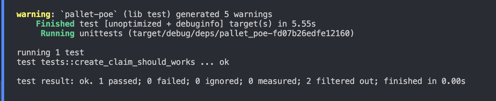
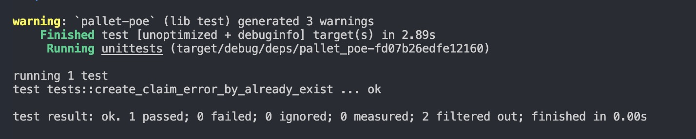
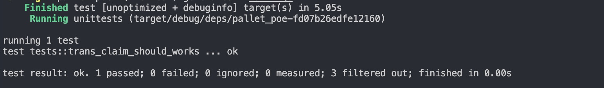
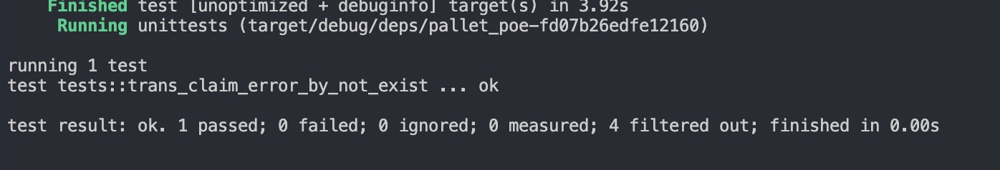
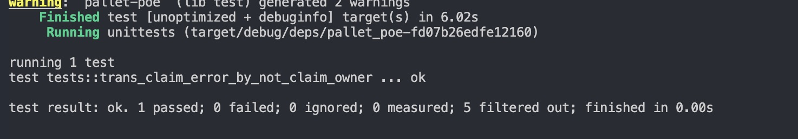
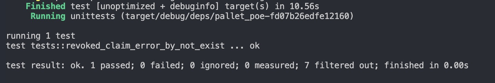
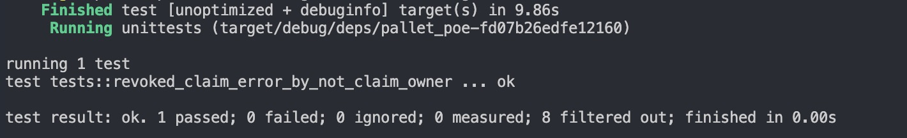
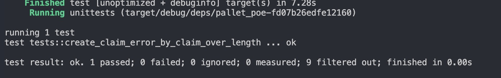

# 第一课作业

## 第一题

###### create_claim_should_works

测试方法 ： create_claim_should_works

###### create_claim_error_by_already_exist

测试方法 ： create_claim_error_by_already_exist

###### trans_claim_should_works

测试方法 ： trans_claim_should_works

###### trans_claim_error_by_not_exist

测试方法 ： trans_claim_error_by_not_exist

###### trans_claim_error_by_not_claim_owner

测试方法 ： trans_claim_error_by_not_claim_owner

###### revoked_claim_should_works

测试方法 ： revoked_claim_should_works

###### revoked_claim_error_by_not_exist

测试方法 ： revoked_claim_error_by_not_exist

###### revoked_claim_error_by_not_claim_owner

测试方法 ： revoked_claim_error_by_norevoked_claim_error_by_not_claim_ownert_exist

## 第二题

###### create_claim_error_by_claim_over_length

测试方法 ： create_claim_error_by_claim_over_length

