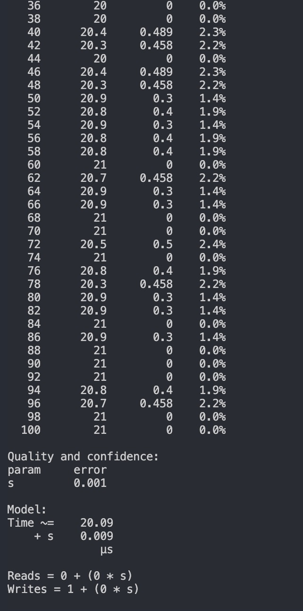

# 第六课作业 


# 第一题:定义dosomething方法的权重

### 目录 template/src/benchmarking.rs

### 指令

``` command
./target/release/node-template benchmark --chain dev --execution=wasm --wasm-execution=compiled --pallet pallet_template --extrinsic do_something --steps 50 --repeat 20 --raw
```




均值20us

### dosomething的权重为

```rust

		#[pallet::weight(20_000_000 + T::DbWeight::get().writes(1))]
		pub fn do_something(origin: OriginFor<T>, something: u32) -> DispatchResult {
			.......
		}

```


# 第二题 选择 node-template 或者其它节点程序，生成 Chain Spec 文件（两种格式都需要）


### 指令

``` command

./target/release/node-template build-spec --chain local >local.json --raw >local-raw.json

```

[local.json](local.json)

[local_raw.json](local_raw.json)